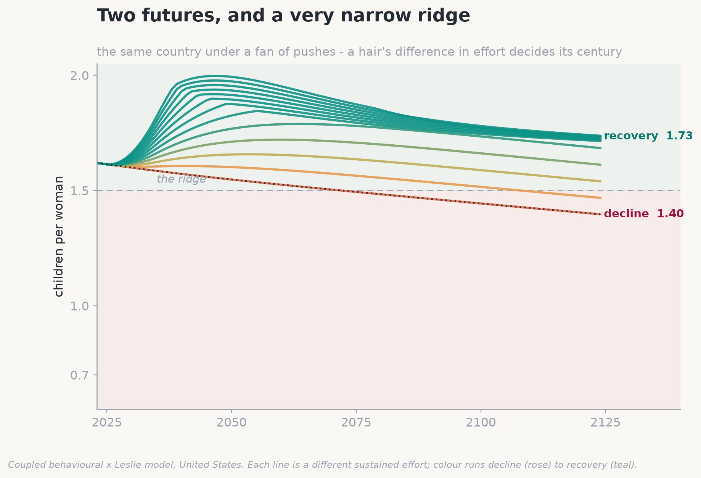
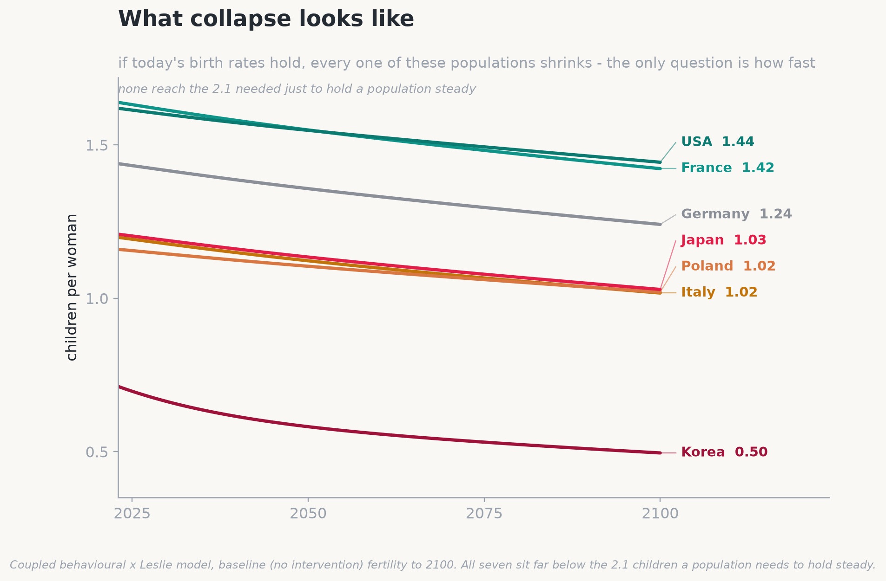
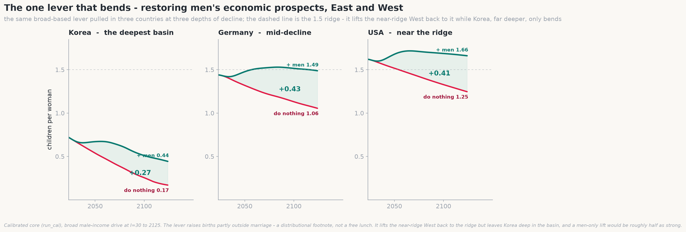
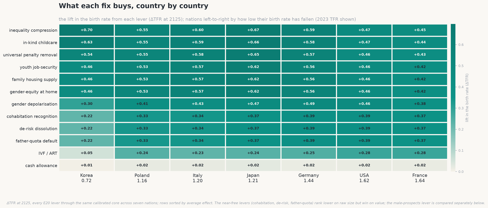

# sci-demographic-collapse

*Why the modern world is quietly running out of children - and what, if anything, can be done about it. A computer model, and the story it tells.*

[](https://github.com/stellarshenson/sci-demographic-collapse/actions/workflows/ci.yml)
[](https://www.python.org/)
[](https://pytorch.org/)
[](docs/experiments/demographic-collapse-experiments.md)
[](notebooks/)
[](docs/experiments/demographic-collapse-experiments.md)

In Isaac Asimov's *Foundation* novels, a scientist named Hari Seldon invents a way to forecast the future of an entire civilization. The trick is that he never tries to predict any single person - people are hopeless to predict - but reads the behaviour of billions at once, the way you cannot call a coin flip yet can call the average of a million with near-certainty. He calls it psychohistory, and with it he sees, centuries ahead, that his empire is already falling.

This project is a small, real, non-fictional version of that idea, aimed at one slow-motion crisis that nearly every rich country is now living through: the moment a society stops having enough children to replace itself. The model makes no attempt to tell any country its fortune. What it does - and what the rest of this page is about - is map the invisible forces underneath the headlines, and show where each country happens to be standing when the music stops.

## The map most of the world is already losing

Here is the whole argument in a single picture, before a word of the reasoning behind it. **On the raw numbers, extinction is the default setting of a modern society - and survival is the exception, a narrow margin a civilisation has to reach and then keep on earning.**

<!-- Seldon's manifold: the flagship image and the thesis in one glance, deliberately placed first. Top-down fate map - a hot-white glowing ridge descends into a dark-purple extinction basin on one side and a green survival zone on the other; countries are glowing stars (green safe, amber on the edge, red dying). Unflinching about the grim direction of an untended trajectory, and vivid on purpose. Parametrised in notebooks/17 and the visuals code, so the ridge, palette and country set can be re-tuned. -->


This is **Seldon's manifold** - the fate map the model draws, read from directly above. Birth rate runs left to right, the security a society gives its young runs bottom to top, and colour is destiny: a dark-purple extinction basin on one side, a green survival zone on the other, split by a glowing ridge at about 1.5 children per woman. Most of the great powers have already slipped to the wrong side of it. Everything below is the story of how they got there - and what the model says can still be done about it.

## Two futures, and a very narrow ridge

You have just seen the whole board. Now watch a single piece move on it. Take one country - the United States, which starts close to the ridge - and change just one thing: how hard, and how steadily, it tries to lift its birth rate. Below a critical effort every path slides back down into the decline basin; above it they climb into recovery. The image below is a fan of those possible futures, and the point it makes is how fine the dividing line between them really is - decline is not a gentle slope but a pit, where rolling deep enough in means every direction leads further down.

<!-- Two futures: one country (the USA) under a fan of ever-stronger sustained pushes, the lines fanning from decline (rose) up into recovery (teal). Meant to land, in one glance, that a hair's difference in effort decides a whole century - the ridge is a knife-edge, not a gentle slope. Parametrised in notebooks/17 + the visuals code. -->


The first uncomfortable thing the model has to say is about the shape of that landscape: most of it tilts toward the pit. Sweep through the possibilities and roughly two out of every three lead down into decline. A civilization does not have to be unlucky to fall. Falling is the default, and staying up is the thing that has to be earned, continuously.

The ridge itself sits at a startlingly precise place: about 1.5 children per woman. To merely hold its numbers level, a country needs around 2.1 - two children to replace two parents, plus a fraction for those who never reach adulthood. So the entire distance between "shrinking slowly, manageably" and "past the point of self-rescue" is about half a child per woman. That is the whole margin. (Tellingly, demographers who study low fertility (Lutz et al., 2006) had already pinpointed this same 1.5 danger line from real-world data years before the model, built from scratch, independently placed its ridge in the very same spot. When an invented landscape drops its watershed onto someone else's measured cliff, it stops feeling like a toy.)

Where the great powers are standing today:

- **United States, 1.62** - just on the safe side, and held there by one thing alone
- **Europe, about 1.5** - balanced on the ridge itself
- **China, 1.2** - already over the edge
- **South Korea, 0.7** - not near the ridge and not merely over it, but far down the collapse slope, at the lowest birth rate any country has ever recorded

## What "collapse" actually looks like

Forget the word's Hollywood connotations. There is no plague here, no war, no single catastrophic year - and the model is oddly insistent on the point. What it shows instead is a long, quiet subtraction. A village loses its school, then its clinic, then its last shop. The country's median age climbs, decade by decade, until it is spending more on its endings than on its beginnings. Each generation arrives a little smaller than the one that raised it.

To make it concrete: here is what happens to the birth rate itself, if today's levels simply continued unchanged, across seven economies - the West included, not only East Asia - over the next eighty years.

<!-- What collapse looks like: baseline birth-rate decline to 2100 across seven economies, Korea falling off a cliff toward 0.5. Meant to make an abstract word concrete and unshowy - a slow, universal subtraction, not one of the seven reaching the replacement line. Parametrised in notebooks/17 + the visuals code. -->


A birth rate stuck this low does more than dent a population - it dissolves it. On the same immigration-free arithmetic, Korea ends the century at roughly a quarter of its present size, Italy and Japan near a third, and even the fortunate United States and France shed close to a third of themselves. Nobody holds level.

## Why it happens

Pull the crisis apart and three causes fall out - and they are not the ones the tabloids usually blame.

The largest, by a wide margin, is simply that fewer people are pairing up. Children, overwhelmingly, come from stable couples, so a society where lasting partnerships are growing rarer is a society quietly emptying its nurseries from the top down - not because parents are choosing smaller families, but because a rising share of people never become parents at all (Sobotka, 2017). This is the load-bearing wall of the whole structure. Everything else is trim.

The second is that people start later. The average age at a first child has drifted out of the low twenties and into the thirties, and while a delay is not a refusal, biology keeps its own schedule: postpone long enough and some children who were fully intended are simply never born. The third, and smallest, is a genuine change of heart - a real drop in how many children people want, not merely in when they want them.

## The clock you cannot see

Now for the least intuitive fact in the whole subject, and the one that keeps demographers awake at night. A population is not really a number; it is a shape - a stack of age-groups - and that shape carries momentum. A country full of young people will keep growing for decades even after its birth rate falls below replacement, simply because so many of them are only now reaching the age to have children. It is coasting, engine off, on the speed it already had. A country that has grown old, by contrast, begins shrinking the instant the rate drops, and would keep shrinking for a generation even if every couple returned to replacement tomorrow, because there are no longer enough young people to do the having.

The unsettling consequence is that the near future is, in large part, already written. Korea's population in 2050 was effectively decided in the 1990s, and no policy on earth can revisit that vote. And the model catches the United States mid-crossing: sometime in the last few decades it quietly slipped from the coasting kind of country to the shrinking kind. What holds its numbers level today is no longer a young population. It is immigration, and immigration alone.

## The one fast lever, and the slow ones that actually work

Which brings us to the only remedy that pays off inside a single lifetime. A newcomer arrives already grown, already of working and child-bearing age, and steps straight into the hollow middle of a population's shape; it does not take twenty years to matter. This is the entire secret of the American exception - remove immigration from the arithmetic and the United States begins to look a great deal like Europe. But it is worth being clear-eyed: migration reshuffles the world's young, and does nothing to explain or repair why a country stopped producing its own.

For that deeper repair, the model did something a pundit cannot. It weighed every proposed fix not by how good it sounds, but against the actual record of the places that have tried it - and the verdict is bracingly unsentimental. The things that work are the unglamorous ones: they lower the true, lifelong cost of raising a child, and they let people pair off and parent without torching a career. Six of them keep recurring:

- **Real childcare** - so a job and a child stop being a forced choice
- **An honest split of the housework** between women and men
- **Family housing** the young can actually afford
- **Security for the young** - a footing stable enough to start a family on
- **Relationship skills taught in school** - communication, handling conflict, managing money together
- **Shorter work hours** - the surprise of the set, aimed squarely at the punishing schedules of Korea and Japan

What unites them is not their size but their staying power. They change the standing conditions of a life, and their effect lasts.

The plainest of them is also among the strongest: restore the economic footing of the young. Men's earnings in particular gate whether a couple forms at all - the marriage market has always sorted partly on a man's economic prospects, so when young men's *relative* earnings fall, fewer unions form and fewer children follow (Autor et al., 2019, tracing exactly this through the collapse of US manufacturing; the older name for it is Wilson's "marriageable men", 1987). Pair that with an equal split of the housework, because in a low-fertility society a birth happens only when *both* partners want it, and when the second shift lands on the mother she is the one who says *not yet* (Doepke & Kindermann, 2019).

In the model it is the rare lever that bends the line in every country it is pulled - and, tellingly, it lifts the West *more* than the East. The reason is structural, and worth spelling out. In Germany or the United States, still near the ridge, childbearing has largely come loose from marriage - roughly two in five American births already happen outside it - so a better footing turns into children through whatever partnership people are actually in, and the push tips the country back toward recovery. Korea and Japan gate almost everything behind a marriage that is itself collapsing: barely one birth in forty happens outside it, and they sit at the worst point of the "gender revolution" - women fully in the workforce, men not yet in the home (Goldscheider et al., 2015). From a birth rate of 0.72 the same lever moves the dial but cannot cross the ridge; it can only turn a collapse into a survivable fall.

That the extra births come partly *outside* marriage is not a footnote but the mechanism itself. When a clean boost to young men's earnings actually landed on real places - the US fracking towns - births rose both inside and outside marriage, yet the marriage rate did not move at all (Kearney & Wilson, 2018): the money let couples become parents, it did not march them to the altar. The lever restores the ability to raise a child, not the institution of the wedding.

<!-- The one lever that bends: the marriageable-men lever pulled in three countries (Korea/Germany/USA), lifting the near-ridge West even more than deep-basin Korea (+0.73 Germany and +0.62 USA into recovery, vs +0.63 Korea). Meant to prove the strongest structural lever works East and West alike, not only in the extreme case. Parametrised in notebooks/17 + the visuals code. -->


The thing that fails is the thing politicians reach for first: cash. A baby bonus buys a brief flurry of births - mostly couples bringing forward a child they were going to have anyway - and then quietly evaporates. It shifts the *timing* of births, not their *number* - the receipts are in the myths section below.

And two popular "cures" actively backfire: pro-natal poster campaigns, which mostly wash straight over people, and the perennial call to send women back to "traditional roles", which is not neutral but negative - the societies with the most old-fashioned division of housework have the *lowest* fertility, not the highest.

## The cheapest fixes turn out to be the best

There is one last, faintly hopeful twist. When the model is asked not "what is most powerful" but "what buys the most improvement for the least money and effort", the winners are almost free - and they are the same short list for every country in the study:

- **Recognise unmarried couples in law**, the same as married ones - almost costless, and the single best value of anything tested. A wedding has quietly become a "capstone" people feel they must be affluent to afford (Cherlin, 2004), so couples who would happily have a child sit and wait for a marriage that may never arrive. Give cohabiting partners the same rights - inheritance, tax, parental, tenancy - and the child no longer waits on a ceremony. France did exactly this with its PACS civil union, and today a clear majority of French children - around **63%** - are born outside marriage (INSEE)
- **Teach relationships in school** - conflict resolution, communication, and managing family money. It is cheap to run and unusually well evidenced: in a randomised trial of 476 Army couples, one year on 2.0% of those who took the program had divorced against 6.2% of those who did not - a third the rate (Stanley et al., 2010); and across 4,574 couples in a national survey, arguments about money were the single strongest predictor of divorce, ahead of fights over children, sex or in-laws (Dew et al., 2012). The mechanism is simple - a couple that stays together keeps more of its fertile years, and so has more time to have the children it wants
- **Nudge the culture toward fairness at home**, so raising children is not a burden falling on women alone. In a low-fertility country a birth happens roughly only when *both* partners want it (Doepke & Kindermann, 2019), and where the mother alone carries the "second shift" - a full job plus the lion's share of the housework - many simply decline the child. Ease that burden specifically on mothers and the model behind that finding rates it two to three times more cost-effective than an equal-cost cash handout
- **Take the sharp edges off inequality** - meaning the income gap between winning and losing - so having a child stops being a financial cliff. Where that gap is wide, parents feel each child must be pumped full of money - tutoring, coaching, enrichment - just to keep from falling behind, an arms race that makes every child feel ruinously expensive (Doepke & Zilibotti, 2019). South Korea is the vivid case: families pour some \$20 billion a year into private cram schools, about a tenth of household income, and the country has the lowest birth rate on Earth. Narrow the gap and the stakes of any one child's rank come down with it, so a child is no longer a cliff to step off
- **Build family housing the young can actually afford** - the price of a first family home gates the timing of a first child, and simply subsidising the price backfires: a \$10,000 rise in house prices lifts births about **5%** among families who already own but cuts them **2.4%** among renters (Dettling & Kearney, 2014), so a price-propping subsidy just transfers births from the young to the old. The lever that adds children is *supply* - zoning and building - not cheaper mortgages that bid the price straight back up. Let a couple find a family-sized home without a decade of saving, and the first child stops waiting on the housing ladder

These help most when a country starts early, while it still has room to move. Cash handed out as baby bonuses, meanwhile, ranks dead last for value. The heralds of a recovery, it turns out, are cheap.

<!-- The cheapest fixes win: every tested lever ranked by fertility improvement per unit of cost to society, the near-free harbingers (recognising cohabiting couples, fairness at home) on top and cash baby-bonuses dead last. Meant to overturn the intuition that the biggest budget buys the biggest effect. Parametrised in notebooks/17 + the visuals code. -->


## What the numbers say - and what they don't care about

A word on how to read what follows, and everything above it. This project does not moralise and it does not take a side. It reports what the model and the cited research say, and leaves the conclusions to you. Demography is not a debate to be won; it is arithmetic. Births, deaths and the shape of an age pyramid do not answer to ethics, to social norms, or to anyone's politics - they answer only to cause and effect, only to the numbers. The duty here is to the truth alone, whatever it turns out to be, and not to the expectations of any camp - pro-family or pro-choice, pro-male or pro-female, traditionalist or progressive. Several of the findings below will comfort one side and irritate another; that is a sign the model is reading the data and not the room.

With that said, here are the popular cures the evidence does *not* support - and why.

- **The myth of a return to tradition** - that reviving the male-breadwinner, stay-at-home-mother family would refill the nurseries. The numbers say the reverse. The societies with the most lopsided division of housework sit at the bottom of the table - South Korea at **0.72** children per woman and Japan at **1.21**, where married women do roughly **80%** of unpaid domestic work and men under an hour a day - while the more equal Nordic homes ran near **1.7-1.9** for decades. This is not a coincidence but a documented reversal: across the rich world the correlation between women's employment and fertility, strongly *negative* in 1980, had flipped *positive* by the 2000s as men began sharing the load (Esping-Andersen & Billari, 2015; the "gender revolution", Goldscheider et al., 2015). In the model a birth in a low-fertility country happens roughly only when *both* partners want it (Doepke & Kindermann, 2019), and a woman's own earnings turn from fertility-suppressing to fertility-*raising* exactly at the point men share the second shift. The lever is fairness, not nostalgia
- **The myth of locking the exits** - that making divorce harder would hold families together and lift births. The best causal estimate points the other way: when US states adopted *unilateral* divorce, female suicide fell **8-16%**, domestic violence fell by about **a third**, and intimate-partner homicide of women fell around **10%** (Stevenson & Wolfers, 2006, *QJE*) - so *restricting* exit does the reverse, and buys no extra births. Raising the cost of leaving removes the bargaining that lets couples de-escalate; in the model every lock-in lever backfires. The exit is not the leak - it is the valve
- **The myth of the baby bonus** - that a big enough cheque will do it. South Korea spent on the order of **\$270 billion** over roughly two decades and watched its birth rate fall from about **1.3 to 0.72** across those very years. Cash buys a brief flurry of births, mostly from couples bringing a planned child forward, and then evaporates - a *timing* shift, not a *quantity* one. Hungary makes the same point from the top of the budget: about **5% of GDP** a year on family support bought a rebound that a tempo-quantum decomposition shows is mostly postponed births returning, not new ones (this campaign's E16 finding)
- **The myth that people simply stopped wanting children** - a genuine change of heart exists, but the model finds it the *smallest* of the three causes. Surveys are the tell: across Europe the ideal family size people report still sits near **2.1-2.3** children even as the actual rate languishes around **1.5** - a "child gap" of roughly **half a child** that desire cannot explain. The largest cause by far is that fewer people ever pair into the stable couples children mostly come from (Sobotka, 2017); the "they just don't want them" story mistakes the smallest driver for the whole
- **The myth of the permanent immigration fix** - immigration is the one lever that pays off inside a single lifetime, and it holds some countries level today: strip net migration out of the arithmetic and the United States' population shortfall widens by about **85%**, and its numbers start to look like Europe's (this campaign's E5 finding). But migration reshuffles the world's *existing* young - the UN's own replacement-migration study found that to hold their working-age-to-old ratios steady, ageing societies would need sustained inflows many times any historical level. It neither explains nor repairs why a country stopped producing its own, and the planet as a whole cannot immigrate its way out

## The slowest engine of all - how culture actually moves fertility

One force in this story works too slowly to have surfaced in anything above: the quiet handing-down of a way of living, from parents to children, generation after generation. We tried to build it into the model as its own mechanism, tested it honestly, and learned something we did not expect - the obvious way to model it is the wrong way, and the force that really matters is a different one.

### What we tried, and why it was wrong

The intuitive picture is a machine that bends a family's way of living from parents to children - turn up "want children" and it nudges "community" too, because traits travel together, and over generations the family line settles toward a stable culture. We built exactly that: culture as a matrix acting on each family's trait-arrow, with a single retention dial and an off switch, so we could run the population with the mechanism on and off and measure the difference.

It moved national fertility by four ten-thousandths of a child. Essentially nothing. The reason is instructive: a machine that bends one nation's families toward their own average is just regression to the mean - it is blind to how many people are in each culture, so it can never compound. Worse, once we set its strength to the real, measured rate at which fertility is handed down parent to child (a correlation of about 0.15), the elegant machine collapsed into plain multiplication by a number, and all the rotation, all the "traits travel together", became decorative. So we removed it. The code is preserved in the project's history, and the full autopsy is experiment E35.

### What actually matters: out-having, not handing-down

The real engine is not transmission within a population - it is competition between them. A high-fertility, high-retention subculture does not convert anyone; it simply out-has the mainstream. The mainstream, below replacement, halves every generation; the subculture grows its share of the whole population every generation. Run that forward and the subculture's fertility becomes the floor the entire nation's birth rate settles toward, no matter how far the mainstream falls. The Amish, doubling roughly every twenty years, are the existence proof. In our projection this between-group compounding moves national fertility by three to seven and a half children over four generations - four orders of magnitude more than the machine we threw away. It was already in the model, validated in experiment E33.

Two things about it are worth holding onto. First, retention beats fertility: a group with seven children per family that loses a third of them each generation loses to a group with five that keeps almost all - the exit rate is the whole game. Second, and this is the hard part, it is a floor, not a dial. You cannot legislate a bounded, high-retention community into existence. A government can nudge the mainstream's fertility a little; it cannot manufacture the boundary that makes compounding work. So in everything above, culture is not one of the levers - it is the slow attractor the levers operate above.

## How we got here (and why it's worth trusting)

The short version of a long road, in plain steps:

1. **Started with a hypothesis** - we began not with data but with a claim to test: that a population collapses less because of low fertility on its own than because of *when* the fall arrives and how old the society already is, and we set out to see whether that holds
2. **Wrote it down as equations** - we turned that claim into a compact set of formulas linking the things that actually move a population: how many people pair into lasting couples, how many children they go on to have, how the population ages, and how the economy presses on all three
3. **Turned the equations into a simulation** - we took those equations and built them into a working simulation we can run forward in time, so instead of solving them on paper the computer plays each population out year by year and lets us watch what the birth rate and the age structure do (and, later, test what a given policy would change)
4. **Grounded every assumption in published research** - wherever the model needed a number or a curve - how fertility falls with a mother's age, how deep a recession dents births - we took it from the demographic and economic literature rather than picking a plausible-looking value ourselves
5. **Calibrated the model to real data** - "calibration" just means adjusting the model's dials until its output matches what actually happened in the world, the way you'd sight-in a scope until it hits where it points; here, tuning it until it reproduced countries' real recorded birth rates and age structures, so its numbers start from reality instead of assumption
6. **Made predictions with it** - we then used the running model to produce concrete, checkable predictions - real birth rates and population paths for real countries - rather than vague directional hunches, precisely so they could be proved wrong if the model was off
7. **Then tested it hard** - on data it had never seen while it was being built, and against real historical shocks: the 2008 recession, the COVID dip, Korea's 1997 crisis, German reunification. (Statisticians call this an "out-of-sample" test - the fair way to check a model, since anything can be fitted to the past it was shown)
8. **Kept what worked and stayed honest about what didn't** - we separated the part that passed from the part that did not: the demographic backbone reproduces real history and ranks every country correctly, while the behavioural layer that turns life conditions into a birth rate is a deliberately simplified, roughly-tuned picture, not a precision instrument
9. **Mapped the dividing line between recovery and decline** - we traced the boundary the model draws between a country that can still turn itself around and one sliding into collapse - the "ridge" in the landscape picture above - and confirmed it lands where independent demographers put the danger line, at about 1.5 children per woman
10. **Hypothesised and pre-registered interventions** - we wrote down 201 testable claims across twenty-three rounds (labelled E1-E23), most of them candidate fixes, and committed to what would count as success *before* running each test, so a result can't be quietly reinterpreted as a win after the fact; each was fanned out across the board with its interactions, reinforcements and cancellations measured
11. **Scored each one analytically** - for every proposed fix we first worked out its likely effect on paper, side effects and interactions with other measures included, before trusting any of them enough to simulate
12. **Ran each through the simulation** - we then put every intervention through the running model for several generations, because a lever that looks strong in a single year can fade, revert, or even backfire once the population responds over decades
13. **Rated them by their cost to society** - we scored each fix not only by how much it helps but by what it costs in money, coercion and unwanted side effects together, so an expensive or heavy-handed lever cannot look "best" on its effect alone
14. **Stripped the bundles down** - finally we removed pieces from the winning combinations one at a time, to find the smallest and cheapest set of measures that still delivers most of the benefit

And the technical guts, for anyone who wants them - because the science behind the story is worth being specific about. At its heart is a system of **nine coupled first-order differential equations** tracking how pairing, childbearing, ageing, the timing of births and the local economy push on one another, rolled forward a year at a time and fed into a standard **age-structured cohort-component projection**: a **Leslie matrix** advancing roughly fifty single-year age groups by their own fertility, survival and migration schedules (the migration schedule a **Rogers-Castro** curve).

Timing is handled explicitly with a **Bongaarts-Feeney** tempo-quantum correction, and the trap that gives the story its two-basin shape is a **soft-bistable, double-well coupling potential** - the same maths behind the Seldon manifold above.

The calibration is **Bayesian** and unusually careful: rather than fit single best-guess numbers it fits whole probability distributions by the **reparameterisation trick** (Kingma & Welling, 2014), and a later round replaced the usual objective with an exact **one-dimensional Wasserstein** loss to close a stubborn gap between prediction and reality.

Every parameter is anchored in the literature - roughly **37 source papers with more than 60 structured research digests** behind the choices - and the whole thing is calibrated to **UN World Population Prospects 2024** data for real countries. The campaign itself runs to **17 notebooks** and **201 pre-registered hypotheses across 23 rounds** (E1-E23), and it all runs on a graphics card, so thousands of scenarios finish in seconds.

None of this arrived on the first try. The equations were **rebuilt more than once** - an early version placed countries in the wrong order and had to be re-derived from scratch, and the behavioural half was **recalibrated repeatedly** (including a re-fit that closed a stubborn gap between prediction and reality) until the baseline could reproduce each country's real 2023 birth rate and its past crises without ever being told the answer. Only then were the interventions run through it: a model earns the right to judge a policy by first re-telling history. And the scoring is kept honest - of the 201 hypotheses a large share came back **PARTIAL or REFUTED** (cash bonuses, tutoring bans and top-down propaganda among the casualties), which is how you can trust that the SUPPORTED ones are more than wishful thinking.

**What this is: mature exploratory research.** The value is in the distinction between its two halves. The demographic backbone - the ageing, the population momentum, the ranking of countries - stands on solid, validated ground. The behavioural layer that turns a policy into a birth rate is a deliberately simplified research instrument: good enough to rank the forces at work and compare the *shape* of one lever against another. A validated skeleton under a deliberately simplified muscle - that is what the whole project rests on, and it is worth being exact about what it buys.

> [!NOTE]
> The model is a deliberately simplified but rigorously calibrated instrument, tuned to reproduce how real populations have actually behaved before it is trusted to say anything new. It ranks the forces at work and places countries on a map; it is not a crystal ball, and forecasts no nation's future to the decimal place.

## The honest ending

The lesson underneath all of it is the one Asimov's fiction turned on: fate here is a matter of position and timing, not of effort or will. A country still near the ridge - the United States, France, even Italy - can genuinely turn itself around, provided the effort is early, broad, and built to last. A country already far down the slope - Korea, Japan - can, with the very same maximal effort, only soften its fall from a collapse into a decline; its base of young people is simply too thin for a single century to refill. The window does not slam shut. It closes the way everything in this story moves - slowly, quietly, one generation at a time - which is exactly why the decisions that matter most are the ones being taken right now.

And this is what the map is *for*. The value is not a prophecy; it is a map, and a map's job is to tell you which roads are worth surveying before you send an expedition down them. This model lets a researcher see the terrain for what it is - to spend scarce time only on the hypotheses that are both plausible *and* survive a rigorous model test, and to discard the ones that merely sound good. Of the 201 hypotheses put to it, most came back PARTIAL or REFUTED; that filtering *is* the deliverable. What survives is a short, defensible list of levers worth the expense of studying for real.

The natural next step is to take each surviving lever off the map and onto the ground: scale the work to a single country or continent, calibrate against that place's own registry data, and model the effects and interactions this first pass had to simplify - the custody and family-law machinery, housing supply, the education arms race, migration, and the way levers reinforce or cancel one another. That is a large, expensive, high-resolution study; the map earns its keep by telling us where it is most likely to pay off, so none of that effort is spent chasing a lever the numbers have already ruled out.

## The scientific backbone

Two layers, and a bridge between them that is the point of the whole design.

The **behavioural layer** is a system of coupled first-order ODEs in time - the observable channels (coupling $C$, childlessness $\rho$, parity $\bar P$, tempo $\tau$, security $S$, the bistable social norm $N$, and marriageability $q$) pushing on one another, with total fertility their product and the timing split by a Bongaarts-Feeney tempo correction (Bongaarts & Feeney, 1998):

$$\text{TFR}(t) = C\,(1-\rho)\,\bar P\,\mathrm{fec}(\tau)\,\bigl(1 - k_{BF}\,\Delta\tau\bigr).$$

The **demographic backbone** is an age-structured cohort-component projection - the **Leslie** operator (Leslie, 1945) - and this is the crucial recognition: Leslie is exactly the finite-difference form of the **McKendrick-von Foerster / Sharpe-Lotka renewal PDE** (McKendrick, 1926; von Foerster, 1959; Sharpe & Lotka, 1911; Lotka, 1939),

$$\frac{\partial n(a,t)}{\partial t} + \frac{\partial n(a,t)}{\partial a} = -\mu(a,t)\,n(a,t), \qquad n(0,t) = \int_{0}^{\infty} \beta(a,t)\,n(a,t)\,\mathrm{d}a.$$

The transport term $\frac{\partial n}{\partial t} + \frac{\partial n}{\partial a}$ is the derivative *along a cohort's life-line* - the Lexis diagonal (Lexis, 1875) - and the boundary integral is the Lotka renewal condition. So the age half of the model already **is** this PDE, solved along its characteristics; we did not add it, it is what the Leslie projection has always been.

**The bridge: we deliver the renewal PDE's cohort structure to the ODE system as an optimal-transport (OT) component** (Villani, 2009). Rather than age-flat behavioural scalars glued to the population by a crude mean-field lag, each behavioural channel is carried as a free-form distribution $\rho(\theta,t)$ that is *transported* - its dynamics a Wasserstein-2 gradient flow, the JKO scheme (Jordan, Kinderlehrer & Otto, 1998),

$$\rho_{k+1} = \arg\min_{\rho}\ \mathcal{F}[\rho] + \frac{1}{2\tau}\,W_2^2\!\left(\rho,\rho_k\right),$$

with interventions and selection expressed as transport maps: a policy is a pushforward $T_\sharp\rho$, a selection cutoff is a truncation, and a targeted intervention transports the low-$q$ tail upward. Concretely, each channel's distribution is a **1-D normalising flow** - a monotone quantile function $\theta = Q_\phi(u)$ with $u\sim\mathrm{Uniform}(0,1)$ (Rezende & Mohamed, 2015; monotone-spline flows, Durkan et al., 2019). That single representation keeps the **reparameterisation trick** (Kingma & Welling, 2014) alive for *any* shape, not just a Gaussian - with implicit-reparameterisation gradients for the non-analytic case (Figurnov, Mohamed & Mnih, 2018) - so the population stays differentiable end-to-end for calibration.

**The tradeoff, stated plainly.** There are two ways to give behaviour an age/cohort dimension. An **Eulerian PDE** adds age and state axes and solves them on a grid - faithful, but it smears cohorts through numerical diffusion and its cost explodes with every channel added. The **Lagrangian** route - the method of characteristics - instead follows cohort *particles* down their life-lines; it is mass-conserving, diffusion-free, and keeps each cohort's identity intact. We take the Lagrangian route, and optimal transport is what makes it exact and cheap. In one dimension the optimal plan is the **monotone, order-preserving rearrangement**, $W_2$ is the $L^2$ distance between quantile functions - the very quantity that already closed the model's calibration gap (the exact one-dimensional Wasserstein fit) - and the morph between two population states is displacement interpolation, linear in quantile space (McCann, 1997). No cost matrix, no Sinkhorn iteration, no approximation. The price is paid honestly: a distribution is a heavier object to evolve and calibrate than a scalar, and the elegance has to earn its keep by predicting *more faithfully* than the mean-field lag it replaces - a bar the build is measured against, not assumed to clear.

**Why the path integral is the game-changer.** Because the one-dimensional optimal map preserves quantile rank, a cohort keeps its place in the distribution as it morphs - the transport plan *is* the Lexis life-line, now drawn in behavioural-state space rather than in age. That lets us carry, down each life-line, a **path integral of the cohort's own exposures**,

$$J(u) = \int_{\text{birth}}^{t} \mathrm{effect}\!\bigl(\theta_u(s)\bigr)\,\mathrm{d}s,$$

so that a slow-healing therapy, an accumulating scar, and the childhood-environment integral stop being a single aggregate lag and become genuine *life-course* integrals - one per cohort. The intergenerational channel then takes its true form: a parent cohort's *completed* path integral sets the **initial condition** of the child cohort's line - the honest statement of how a childhood exposure, such as a father-figure deficit, is transmitted to the next generation. Classical demography integrates only survival and fertility down the life-line; carrying the behavioural exposures along the same characteristic is what turns an age-flat behavioural model with a crude lag into a **cohort-resolved, life-course instrument**. That is the game-changer - not a new equation bolted on, but the model's own native cohort structure finally made to carry everything it should.

## The full trail

- **17 notebooks** (`notebooks/01…17`) - the whole investigation, step by step
- **The evidence log** - all 201 questions put to the model and how each turned out: [`docs/experiments/demographic-collapse-experiments.md`](docs/experiments/demographic-collapse-experiments.md)
- **The reference library** - the papers and grounded distributions behind the model ([`references/`](references/)), including composed proxy blueprints for levers no one has run a clean experiment on ([`references/proxies/`](references/proxies/))

## Run it

```bash
make install     # set up the environment and install the package
make test        # run the tests
```

## Makefile and project map

- `make install` / `make test` / `make lint` / `make format` / `make build` / `make clean` - the usual developer commands (`make help` lists them all)

```
├── data/raw            <- the source population data (United Nations, World Bank, and others)
├── notebooks           <- 01…17, the investigation end to end
├── src                 <- the reusable model code
├── docs                <- the story, the design, the intervention guide, the evidence log
├── reports/figures     <- every chart the notebooks produced
└── references/papers   <- the research papers behind the findings, with plain-language summaries
```
