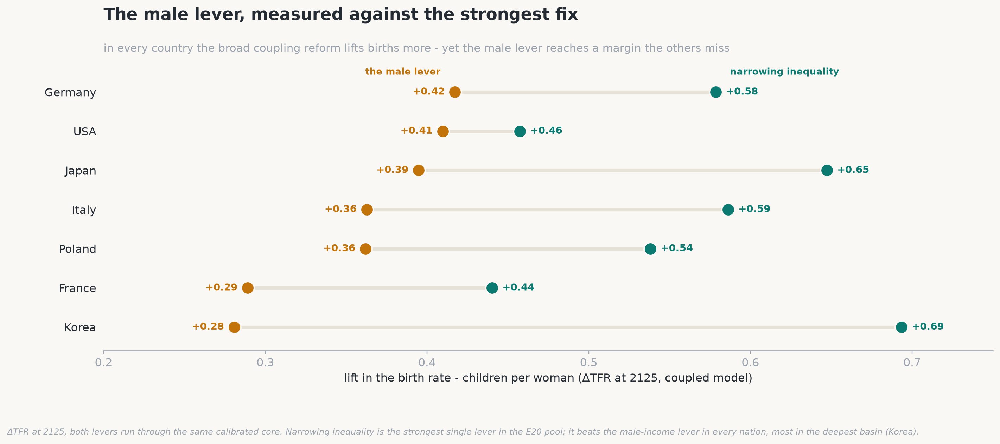

# sci-demographic-collapse

*Why the modern world is quietly running out of children - and what, if anything, can be done about it. A computer model, and the story it tells.*

[](https://github.com/stellarshenson/sci-demographic-collapse/actions/workflows/ci.yml)
[](https://www.python.org/)
[](https://pytorch.org/)
[](https://pyro.ai/)
[](https://www.arviz.org/)
[](https://scipy.org/)
[](https://numpy.org/)
[](docs/experiments/demographic-collapse-experiments.md)
[](docs/experiments/demographic-collapse-experiments.md)

In Isaac Asimov's *Foundation* novels, a scientist named Hari Seldon invents a way to forecast the future of an entire civilization. The trick is that he never tries to predict any single person - people are hopeless to predict - but reads the behaviour of billions at once, the way you cannot call a coin flip yet can call the average of a million with near-certainty. He calls it psychohistory, and with it he sees, centuries ahead, that his empire is already falling.

This project is a small, real, non-fictional version of that idea, aimed at one slow-motion crisis that nearly every rich country is now living through: the moment a society stops having enough children to replace itself. The model makes no attempt to tell any country its fortune. What it does - and what the rest of this page is about - is map the invisible forces underneath the headlines, and show where each country happens to be standing when the music stops.

## The map most of the world is already losing

Here is the whole argument in a single picture, before a word of the reasoning behind it. **On the raw numbers, extinction is the default setting of a modern society - and survival is the exception, a narrow margin a civilisation has to reach and then keep on earning.**

<!-- Seldon's manifold: the flagship image and the thesis in one glance, deliberately placed first. Top-down fate map - a hot-white glowing ridge descends into a dark-purple extinction basin on one side and a green survival zone on the other; countries are glowing stars (green safe, amber on the edge, red dying). Unflinching about the grim direction of an untended trajectory, and vivid on purpose. Parametrised in notebooks/17 and the visuals code, so the ridge, palette and country set can be re-tuned. -->


This is **Seldon's manifold** - the fate map the model draws, read from directly above. Birth rate runs left to right, the security a society gives its young runs bottom to top, and colour is destiny: a dark-purple extinction basin on one side, a green survival zone on the other, split by a glowing ridge at about 1.5 children per woman. Most of the great powers have already slipped to the wrong side of it; only Israel, alone among developed nations, holds deep in the green. Everything below is the story of how they got there - and what the model says can still be done about it.

## Two futures, and a very narrow ridge

You have just seen the whole board. Now watch a single piece move on it. Take one country - the United States, which starts close to the ridge - and change just one thing: how hard, and how steadily, it tries to lift its birth rate. Below a critical effort every path slides back down into the decline basin; above it they climb into recovery. The image below is a fan of those possible futures, and the point it makes is how fine the dividing line between them really is - decline is not a gentle slope but a pit, where rolling deep enough in means every direction leads further down.

<!-- Two futures: one country (the USA) under a fan of ever-stronger sustained pushes, the lines fanning from decline (rose) up into recovery (teal). Meant to land, in one glance, that a hair's difference in effort decides a whole century - the ridge is a knife-edge, not a gentle slope. Parametrised in notebooks/17 + the visuals code. -->


The first uncomfortable thing the model has to say is about the shape of that landscape: most of it tilts toward the pit. Sweep through the possibilities and roughly two out of every three lead down into decline. A civilization does not have to be unlucky to fall. Falling is the default, and staying up is the thing that has to be earned, continuously.

The ridge itself sits at a startlingly precise place: about 1.5 children per woman. To merely hold its numbers level, a country needs around 2.1 - two children to replace two parents, plus a fraction for those who never reach adulthood. So the entire distance between "shrinking slowly, manageably" and "past the point of self-rescue" is about half a child per woman. That is the whole margin. (Tellingly, demographers who study low fertility (Lutz et al., 2006) had already pinpointed this same 1.5 danger line from real-world data years before the model, built from scratch, independently placed its ridge in the very same spot. When an invented landscape drops its watershed onto someone else's measured cliff, it stops feeling like a toy.)

Where the great powers are standing today:

- **United States, 1.62** - just on the safe side, and held there by one thing alone
- **Europe, about 1.5** - balanced on the ridge itself
- **China, 1.2** - already over the edge
- **South Korea, 0.7** - not near the ridge and not merely over it, but far down the collapse slope, at the lowest birth rate any country has ever recorded

## What "collapse" actually looks like

Forget the word's Hollywood connotations. There is no plague here, no war, no single catastrophic year - and the model is oddly insistent on the point. What it shows instead is a long, quiet subtraction. A village loses its school, then its clinic, then its last shop. The country's median age climbs, decade by decade, until it is spending more on its endings than on its beginnings. Each generation arrives a little smaller than the one that raised it.

To make it concrete: here is what happens to the birth rate itself, if today's levels simply continued unchanged, across seven economies - the West included, not only East Asia - over the next eighty years.

<!-- What collapse looks like: baseline birth-rate decline to 2100 across seven economies, Korea falling off a cliff toward 0.5. Meant to make an abstract word concrete and unshowy - a slow, universal subtraction, not one of the seven reaching the replacement line. Parametrised in notebooks/17 + the visuals code. -->


A birth rate stuck this low does more than dent a population - it dissolves it. On the same immigration-free arithmetic, Korea ends the century at roughly a quarter of its present size, Italy and Japan near a third, and even the fortunate United States and France shed close to a third of themselves. Nobody holds level.

## Why it happens

Pull the crisis apart and three causes fall out - and they are not the ones the tabloids usually blame.

The largest, by a wide margin, is simply that fewer people are pairing up. Children, overwhelmingly, come from stable couples, so a society where lasting partnerships are growing rarer is a society quietly emptying its nurseries from the top down - not because parents are choosing smaller families, but because a rising share of people never become parents at all (Sobotka, 2017). This is the load-bearing wall of the whole structure. Everything else is trim.

The second is that people start later. The average age at a first child has drifted out of the low twenties and into the thirties, and while a delay is not a refusal, biology keeps its own schedule: postpone long enough and some children who were fully intended are simply never born. The third, and smallest, is a genuine change of heart - a real drop in how many children people want, not merely in when they want them.

## The clock you cannot see

Now for the least intuitive fact in the whole subject, and the one that keeps demographers awake at night. A population is not really a number; it is a shape - a stack of age-groups - and that shape carries momentum. A country full of young people will keep growing for decades even after its birth rate falls below replacement, simply because so many of them are only now reaching the age to have children. It is coasting, engine off, on the speed it already had. A country that has grown old, by contrast, begins shrinking the instant the rate drops, and would keep shrinking for a generation even if every couple returned to replacement tomorrow, because there are no longer enough young people to do the having.

The unsettling consequence is that the near future is, in large part, already written. Korea's population in 2050 was effectively decided in the 1990s, and no policy on earth can revisit that vote. And the model catches the United States mid-crossing: sometime in the last few decades it quietly slipped from the coasting kind of country to the shrinking kind. What holds its numbers level today is no longer a young population. It is immigration, and immigration alone.

<div align="center">

### *The near future is, in large part, already written.*

</div>

## The one fast lever, and the slow ones that actually work

Which brings us to the only remedy that pays off inside a single lifetime. A newcomer arrives already grown, already of working and child-bearing age, and steps straight into the hollow middle of a population's shape; it does not take twenty years to matter. This is the entire secret of the American exception - remove immigration from the arithmetic and the United States begins to look a great deal like Europe. But it is worth being clear-eyed: migration reshuffles the world's young, and does nothing to explain or repair why a country stopped producing its own.

For that deeper repair, the model did something a pundit cannot. It weighed every proposed fix not by how good it sounds, but against the actual record of the places that have tried it - and the verdict is bracingly unsentimental. The things that work are the unglamorous ones: they lower the true, lifelong cost of raising a child, and they let people pair off and parent without torching a career. Seven of them keep recurring, and one is worth singling out - not because it is the largest, but because of the margin it reaches.

**Marriageable young men - the lever aimed at the men.** Restore the economic prospects of young men. The marriage market still sorts on them, and their *relative* decline is what stops couples forming - so this is the strongest lever aimed squarely at young men, a margin the broad reforms do not directly touch. It bends every country, though, as we will see, the broadest coupling reforms lift births by more. The other six change the standing conditions of a life; this one decides whether the couple forms at all:

- **Real childcare** - so a job and a child stop being a forced choice
- **An honest split of the housework** between women and men
- **Family housing** the young can actually afford
- **Security for the young** - a footing stable enough to start a family on
- **Relationship skills taught in school** - communication, handling conflict, managing money together
- **Shorter work hours** - the surprise of the set, aimed squarely at the punishing schedules of Korea and Japan

What unites them is not their size but their staying power. They change the standing conditions of a life, and their effect lasts.

The plainest of them is also among the most consequential: restore the economic footing of the young. Men's earnings in particular gate whether a couple forms at all - the marriage market has always sorted partly on a man's economic prospects, so when young men's *relative* earnings fall, fewer unions form and fewer children follow. The cleanest measurement comes from the US manufacturing towns hit by Chinese import competition: as men's fortunes there fell, births dropped by **6.1 per thousand** women of childbearing age and marriages by **4.2 percent** (Autor, Dorn & Hanson, 2019). The pattern is old enough to have a name - Wilson's "marriageable men" (1987). Pair that footing with an equal split of the housework, because in a low-fertility society a birth happens only when *both* partners want it, and when the second shift lands on the mother she is the one who says *not yet* (Doepke & Kindermann, 2019).

In the model it bends the line in every country it is pulled - and, tellingly, it lifts the West *more* than the East. The reason is structural, and worth spelling out. In Germany or the United States, still near the ridge, childbearing has largely come loose from marriage - roughly two in five American births already happen outside it - so a better footing turns into children through whatever partnership people are actually in, and the push tips the country back toward recovery. Korea and Japan gate almost everything behind a marriage that is itself collapsing: barely one birth in forty happens outside it, and they sit at the worst point of the "gender revolution" - women fully in the workforce, men not yet in the home (Goldscheider et al., 2015). From a birth rate of 0.72 the same lever moves the dial but cannot cross the ridge; it can only turn a collapse into a survivable fall.

That the extra births come partly *outside* marriage is not a footnote but the mechanism itself. When a clean boost to young men's earnings actually landed on real places - the US fracking towns - births rose about **3 percent**, inside and outside marriage alike, yet the marriage rate did not move at all (Kearney & Wilson, 2018): the money let couples become parents, it did not march them to the altar. The lever restores the ability to raise a child, not the institution of the wedding.

Two honest limits, and a re-simulation put hard numbers on both. First, the lever *saturates*. Because the marriage market sorts on *relative* standing, the first gains in men's fortunes do most of the work and the last buy almost nothing - in the model the effect climbs steeply, then flattens against a ceiling. And that ceiling sits low: to drag South Korea from **0.72** back up to the **1.5** ridge on men's earnings alone would take a sustained income gain no real economy has ever delivered - the curve runs out of road long before it reaches the line. The lever bends a country's path; on its own it does not reverse it. Second, it is not enough to lift *men*. A raise that lands only on men - or only on some of them - widens the very inequality and marriage-market gap that suppress births, and the model finds that self-cancelling backlash **cuts the effect roughly in half**. The strong form is broad-based and gender-balanced - his footing and hers together - which is why it belongs beside fairness at home and narrower inequality rather than standing alone.

<!-- The one lever that bends: the marriageable-men lever on the calibrated core (run_cal, E36 broad male drive at I=30) in Korea/Poland/Germany/USA. Recomputed from the illustrative pre-E36 core - the lever BENDS every path and lifts the near-ridge West back toward the 1.5 ridge (Germany ~1.49, USA ~1.66) but leaves the deep basins far below it (Korea ~0.44, Poland ~1.16), so it does not reverse a collapse alone; a concentrated men-only lift roughly halves the effect via the inequality + hypergamy counter-terms. Parametrised in notebooks/17 + the visuals code. -->


The thing that fails is the thing politicians reach for first: cash. A baby bonus buys a brief flurry of births - mostly couples bringing forward a child they were going to have anyway - and then quietly evaporates. It shifts the *timing* of births, not their *number* - the receipts are in the myths section below.

And two popular "cures" actively backfire: pro-natal poster campaigns, which mostly wash straight over people, and the perennial call to send women back to "traditional roles", which is not neutral but negative - the societies with the most old-fashioned division of housework have the *lowest* fertility, not the highest.

## The cheapest fixes turn out to be the best

There is one last, faintly hopeful twist. When the model is asked not "what is most powerful" but "what buys the most improvement for the least money and effort", the winners are almost free - and they are the same short list for every country in the study:

- **Recognise unmarried couples in law**, the same as married ones - almost costless, and the single best value of anything tested. A wedding has quietly become a "capstone" people feel they must be affluent to afford (Cherlin, 2004), so couples who would happily have a child sit and wait for a marriage that may never arrive. Give cohabiting partners the same rights - inheritance, tax, parental, tenancy - and the child no longer waits on a ceremony. France did exactly this with its PACS civil union, and today a clear majority of French children - around **63%** - are born outside marriage (INSEE)
- **Teach relationships in school** - conflict resolution, communication, and managing family money. It is cheap to run and unusually well evidenced: in a randomised trial of 476 Army couples, one year on 2.0% of those who took the program had divorced against 6.2% of those who did not - a third the rate (Stanley et al., 2010); and across 4,574 couples in a national survey, arguments about money were the single strongest predictor of divorce, ahead of fights over children, sex or in-laws (Dew et al., 2012). The mechanism is simple - a couple that stays together keeps more of its fertile years, and so has more time to have the children it wants
- **Nudge the culture toward fairness at home**, so raising children is not a burden falling on women alone. In a low-fertility country a birth happens roughly only when *both* partners want it (Doepke & Kindermann, 2019), and where the mother alone carries the "second shift" - a full job plus the lion's share of the housework - many simply decline the child. Ease that burden specifically on mothers and the model behind that finding rates it two to three times more cost-effective than an equal-cost cash handout
- **Take the sharp edges off inequality** - meaning the income gap between winning and losing - so having a child stops being a financial cliff. Where that gap is wide, parents feel each child must be pumped full of money - tutoring, coaching, enrichment - just to keep from falling behind, an arms race that makes every child feel ruinously expensive (Doepke & Zilibotti, 2019). South Korea is the vivid case: families pour some \$20 billion a year into private cram schools (Statistics Korea), about a tenth of household income, and the country has the lowest birth rate on Earth. Narrow the gap and the stakes of any one child's rank come down with it, so a child is no longer a cliff to step off
- **Build family housing the young can actually afford** - the price of a first family home gates the timing of a first child, and simply subsidising the price backfires: a \$10,000 rise in house prices lifts births about **5%** among families who already own but cuts them **2.4%** among renters (Dettling & Kearney, 2014), so a price-propping subsidy just transfers births from the young to the old. The lever that adds children is *supply* - zoning and building - not cheaper mortgages that bid the price straight back up. Let a couple find a family-sized home without a decade of saving, and the first child stops waiting on the housing ladder. One caution the model adds: housing is not a lever standing outside the pairing problem - singles need a dwelling each where a couple shares one, so as couple-formation declines, housing demand grows *by itself*. In the model that force alone raises Korea's household demand about **27%** by century's end, eating a +10% building program nearly three times over by 2062 - a housing policy sized against today's household counts is undersized against the very decline it is meant to fight. The reverse also holds: every lever that helps couples form frees dwellings, quietly funding roughly a tenth of its own gain

> [!IMPORTANT]
> **The male prospects problem** *- the uncomfortable margin nobody wants to name*<br><br>One lever belongs here by its absence. Restoring young men's economic prospects does not appear on this list because it is the *costliest* - a sustained mountain of earnings rather than a near-free reform - and, once every lever is run through the *same* model, it is not even the largest effect: narrowing inequality lifts births by more, in every country. What makes the male lever matter is not its size but its *aim*: it is the strongest lever pointed squarely at young men, the one margin the broad reforms do not directly touch. And the cheap way to make it pay is already on the list - deliver the gains *broadly*, by narrowing inequality, rather than as a concentrated windfall to a few, because a lopsided boom widens the very income gap that makes children feel ruinously expensive, and largely cancels itself.
>
> The harder barrier is cultural, not fiscal. It is genuinely difficult for a public conversation to accept that young men - the group long assumed to hold the advantages - are now the ones whose prospects most need repair. But demography does not wait for that discomfort to settle: if young men cannot form couples, the births do not follow, and the society ages into decline all the same. The truth being uncomfortable does not make it any less true; refusing it only lets the problem compound until the fall is far harder to stop.

These help most when a country starts early, while it still has room to move. Cash handed out as baby bonuses, meanwhile, ranks dead last for value. The heralds of a recovery, it turns out, are cheap. The chart below runs every lever through the same model for seven countries, now including Poland - Europe's lowest-low at 1.16 by its own statistical office (GUS), below the higher UN estimate.

<!-- What each fix buys, country by country: every E20 lever re-run through the current calibrated core (run_cal) and shown as ΔTFR at 2125 (children per woman) across all seven nations - a heatmap, rows sorted by average effect, nations left-to-right by 2023 TFR. Replaces the old Korea-only efficiency-ratio ranking with the relatable ΔTFR unit per country. The broad coupling reforms (inequality compression, in-kind childcare) lead on raw size; the near-free levers win on value. Parametrised in notebooks/17 + the visuals code. -->


The male-prospects lever is absent from that chart because it is the costliest - and, run through the same model, it is not the largest effect either. Set head to head against the strongest broad fix, narrowing inequality wins in every country: in Korea by **+0.70** to **+0.27**, and even in Germany, where the male lever is strongest, by **+0.59** to **+0.43**. What the male lever has that the others do not is its *aim* - it is the one pointed at young men, the margin the broad reforms miss - and it still bends every country, most where there is room to move (E36).

<!-- The male lever vs the strongest fix, per nation: the broad-based male-income lever (drive-alone) vs narrowing inequality (the strongest lever in the E20 pool), both run through the same calibrated core (run_cal), ΔTFR at 2125. Inequality leads in every nation - Korea +0.70 vs +0.27, Germany +0.59 vs +0.43 - widest in the deepest basin. The male lever's importance is the margin it reaches (young men), not its magnitude. Parametrised in notebooks/17 + the visuals code. -->


## Do the fixes add up?

A natural question about any list of levers is whether pulling several at once beats pulling them one at a time. The model gives a clean answer, and it is not the flattering one. A birth rate is the *product* of the things underneath it - couples formed, times children per couple, times the rest - so on the right (logarithmic) scale the effects of independent levers simply *add*, with a single extra term that measures whether two levers genuinely reinforce or quietly step on each other.

The rule that falls out is unglamorous. Two fixes that pull *different* channels - a better economic footing and an honest split of the housework - reinforce, and the pair is worth more than the sum of its parts. Two that pull the *same* channel - two different ways of easing the same financial squeeze - saturate, and the second one adds little. An earlier round of this project thought it had found dramatic "super-additive" bundles where stacking paid double; a closer look showed almost all of that was an illusion of the arithmetic - the natural upward curve of a product - and not real synergy. So the honest guidance is to stack levers that work through *different* mechanisms, and never to expect two versions of the same lever to pay twice.

## What the numbers say - and what they don't care about

A word on how to read what follows, and everything above it. This project does not moralise and it does not take a side. It reports what the model and the cited research say, and leaves the conclusions to you. Demography is not a debate to be won; it is arithmetic. Births, deaths and the shape of an age pyramid do not answer to ethics, to social norms, or to anyone's politics - they answer only to cause and effect, only to the numbers. The duty here is to the truth alone, whatever it turns out to be, and not to the expectations of any camp - pro-family or pro-choice, pro-male or pro-female, traditionalist or progressive. Several of the findings below will comfort one side and irritate another; that is a sign the model is reading the data and not the room.

With that said, here are the popular cures the evidence does *not* support - and why.

- **The myth of a return to tradition** - that reviving the male-breadwinner, stay-at-home-mother family would refill the nurseries. The numbers say the reverse. The societies with the most lopsided division of housework sit at the bottom of the table - South Korea at **0.72** children per woman and Japan at **1.21**, where married women do roughly **80%** of unpaid domestic work and men under an hour a day - while the more equal Nordic homes ran near **1.7-1.9** for decades. This is not a coincidence but a documented reversal: across the rich world the correlation between women's employment and fertility, strongly *negative* in 1980, had flipped *positive* by the 2000s as men began sharing the load (Esping-Andersen & Billari, 2015; the "gender revolution", Goldscheider et al., 2015). In the model a birth in a low-fertility country happens roughly only when *both* partners want it (Doepke & Kindermann, 2019), and a woman's own earnings turn from fertility-suppressing to fertility-*raising* exactly at the point men share the second shift. The lever is fairness, not nostalgia
- **The myth of locking the exits** - that making divorce harder would hold families together and lift births. The best causal estimate points the other way: when US states adopted *unilateral* divorce, female suicide fell **8-16%**, domestic violence fell by about **a third**, and intimate-partner homicide of women fell around **10%** (Stevenson & Wolfers, 2006, *QJE*) - so *restricting* exit does the reverse, and buys no extra births. Raising the cost of leaving removes the bargaining that lets couples de-escalate; in the model every lock-in lever backfires. The exit is not the leak - it is the valve
- **The myth of the baby bonus** - that a big enough cheque will do it. South Korea spent, by the government's own accounting, on the order of **\$270 billion** over roughly two decades and watched its birth rate fall from about **1.3 to 0.72** across those very years. Cash buys a brief flurry of births, mostly from couples bringing a planned child forward, and then evaporates - a *timing* shift, not a *quantity* one. Hungary makes the same point from the top of the budget: about **5% of GDP** a year on family support bought a rebound that a timing-versus-quantity split shows is mostly postponed births returning, not new ones (this campaign's E16 finding)
- **The myth that people simply stopped wanting children** - a genuine change of heart exists, but the model finds it the *smallest* of the three causes. Surveys are the tell: across Europe the ideal family size people report still sits near **2.1-2.3** children even as the actual rate languishes around **1.5** - a "child gap" of roughly **half a child** that desire cannot explain. The largest cause by far is that fewer people ever pair into the stable couples children mostly come from (Sobotka, 2017); the "they just don't want them" story mistakes the smallest driver for the whole
- **The myth of the permanent immigration fix** - immigration is the one lever that pays off inside a single lifetime, and it holds some countries level today: strip net migration out of the arithmetic and the United States' population shortfall widens by about **85%**, and its numbers start to look like Europe's (this campaign's E5 finding). But migration reshuffles the world's *existing* young - the UN's own replacement-migration study found that to hold their working-age-to-old ratios steady, ageing societies would need sustained inflows many times any historical level. It neither explains nor repairs why a country stopped producing its own, and the planet as a whole cannot immigrate its way out

## The slowest engine of all - how culture actually moves fertility

One force in this story works too slowly to have surfaced in anything above: the quiet handing-down of a way of living, from parents to children, generation after generation. In the model it is not a lever you pull but the slow attractor the levers operate above.

The real engine is not transmission within a population - it is competition between them. A high-fertility, high-retention subculture does not convert anyone; it simply out-has the mainstream. The mainstream, below replacement, halves every generation; the subculture grows its share of the whole population every generation. Run that forward and the subculture's fertility becomes the floor the entire nation's birth rate settles toward, no matter how far the mainstream falls. The Amish, doubling roughly every twenty years, are the existence proof. In our projection this between-group compounding sets the national floor - the level the whole country's birth rate settles toward over four generations - at roughly four to seven children per woman. It was already in the model, validated in experiment E33.

The formalism is a two-compartment replicator, not a matrix. Let $x_g$ be the subculture's share of births at generation $g$, and let each side's per-generation growth be its fertility over replacement - the mainstream $R_{\text{main}} = \text{TFR}_{\text{main}}/2.05 < 1$, the subculture $R_{\text{sub}} = (\text{TFR}_{\text{sub}}/2.05)\,(1-\delta)(1-\beta x_g)$, discounted by an apostasy rate $\delta$ and an edge-secularisation $\beta$. The share then updates by the standard selection ratio, and the national rate is the share-weighted blend:

$$x_{g+1} = \frac{R_{\text{sub}}\,x_g}{R_{\text{sub}}\,x_g + R_{\text{main}}\,(1-x_g)}, \qquad \text{TFR}_{\text{nat}} = x_g\,\text{TFR}_{\text{sub}} + (1-x_g)\,\text{TFR}_{\text{main}}.$$

Whenever $R_{\text{sub}} > R_{\text{main}}$ the share climbs to one and the national rate is dragged to the subculture's floor $\text{TFR}_{\text{sub}}$. The load-bearing term is $\delta$, not fertility: retention, the exit rate, decides the whole race.

Two things about it are worth holding onto. First, retention beats fertility: a group with seven children per family that loses a third of them each generation loses to a group with five that keeps almost all - the exit rate is the whole game. Second, and this is the hard part, it is a floor, not a dial. You cannot legislate a bounded, high-retention community into existence. A government can nudge the mainstream's fertility a little; it cannot manufacture the boundary that makes compounding work. So in everything above, culture is not one of the levers - it is the slow attractor the levers operate above.

## The one country that didn't fall - Israel

Every country on this map is shrinking except one. Israel holds at **2.83** children per woman, above replacement and alone in the developed world (UN WPP 2024) - the closest thing demography has to a natural experiment in what keeps a birth rate up, so we calibrated it into the model as an eighth country (this campaign's E37 round).

The success is **not the ultra-Orthodox**. Take the Haredi out, and the three-quarters of Jewish Israelis who are secular or traditional still sit at or above replacement - secular Jews near **1.98**, the highest of any secular society on Earth, and the gap survives controls for women's work and education (Okun, 2017; Weinreb, Taub Center, 2024). It is a norm, not a paycheck.

So we asked the model where that norm lives. Give South Korea Israel's **coupling** - near-universal, stable partnership - and its projected birth rate jumps **+0.74** (and **+0.82** once the dwellings the extra couples free are counted back into the housing market); give it Israel's low childfree norm or its low childlessness instead, and nothing moves (-0.001, +0.008). Israel's pronatal culture is not a wish for babies; it is couples that form and stay formed - the exact channel every winning lever above already pulls. The copyable pieces are real but bounded: universal IVF is barely 4% of births (Birenbaum-Carmeli, 2016), and the dense-childcare bundle behind 61% female employment is the gender-equity lever this project already crowns. Run it all through the model and a collapsing country reaches the 1.5 ridge, not 2.83 - the rest is age structure, desired family size, and the compounding Haredi subculture, none of them a dial a government can turn.

<div align="center">

### *You cannot copy your way to Israel - but the part you can copy is already on the list.*

</div>

## How we got here (and why it's worth trusting)

The short version of a long road, in plain steps:

1. **Started with a hypothesis** - we began not with data but with a claim to test: that a population collapses less because of low fertility on its own than because of *when* the fall arrives and how old the society already is, and we set out to see whether that holds
2. **Wrote it down as equations** - we turned that claim into a compact set of formulas linking the things that actually move a population: how many people pair into lasting couples, how many children they go on to have, how the population ages, and how the economy presses on all three
3. **Turned the equations into a simulation** - we took those equations and built them into a working simulation we can run forward in time, so instead of solving them on paper the computer plays each population out year by year and lets us watch what the birth rate and the age structure do (and, later, test what a given policy would change)
4. **Grounded every assumption in published research** - wherever the model needed a number or a curve - how fertility falls with a mother's age, how deep a recession dents births - we took it from the demographic and economic literature rather than picking a plausible-looking value ourselves
5. **Calibrated the model to real data** - "calibration" just means adjusting the model's dials until its output matches what actually happened in the world, the way you'd sight-in a scope until it hits where it points; here, tuning it until it reproduced countries' real recorded birth rates and age structures, so its numbers start from reality instead of assumption
6. **Made predictions with it** - we then used the running model to produce concrete, checkable predictions - real birth rates and population paths for real countries - rather than vague directional hunches, precisely so they could be proved wrong if the model was off
7. **Then tested it hard** - on data it had never seen while it was being built, and against real historical shocks: the 2008 recession, the COVID dip, Korea's 1997 crisis, German reunification. (Statisticians call this an "out-of-sample" test - the fair way to check a model, since anything can be fitted to the past it was shown)
8. **Kept what worked and stayed honest about what didn't** - we separated the part that passed from the part that did not: the demographic backbone reproduces real history and ranks every country correctly, while the behavioural layer that turns life conditions into a birth rate is a deliberately simplified, roughly-tuned picture, not a precision instrument
9. **Mapped the dividing line between recovery and decline** - we traced the boundary the model draws between a country that can still turn itself around and one sliding into collapse - the "ridge" in the landscape picture above - and confirmed it lands where independent demographers put the danger line, at about 1.5 children per woman
10. **Hypothesised and pre-registered interventions** - we wrote down 392 testable claims across forty rounds (labelled E1-E40; two of those rounds, E13 and E40, audit the campaign itself rather than add claims), most of them candidate fixes, and committed to what would count as success *before* running each test, so a result can't be quietly reinterpreted as a win after the fact; each was fanned out across the board with its interactions, reinforcements and cancellations measured
11. **Scored each one analytically** - for every proposed fix we first worked out its likely effect on paper, side effects and interactions with other measures included, before trusting any of them enough to simulate
12. **Ran each through the simulation** - we then put every intervention through the running model for several generations, because a lever that looks strong in a single year can fade, revert, or even backfire once the population responds over decades
13. **Rated them by their cost to society** - we scored each fix not only by how much it helps but by what it costs in money, coercion and unwanted side effects together, so an expensive or heavy-handed lever cannot look "best" on its effect alone
14. **Stripped the bundles down** - finally we removed pieces from the winning combinations one at a time, to find the smallest and cheapest set of measures that still delivers most of the benefit

And the technical guts, for anyone who wants them - because the science behind the story is worth being specific about. At its heart is a system of **seven coupled first-order differential equations** tracking how pairing, childbearing, the timing of births, economic security, the surrounding social norm and partner-marriageability push on one another - nine equations in all once the intergenerational memory integral and the fertility composition law are counted, and each is laid out one by one in the walkthrough below - rolled forward a year at a time and fed into a standard **age-structured cohort-component projection**: a **Leslie matrix** advancing roughly fifty single-year age groups by their own fertility, survival and migration schedules (the migration schedule a **Rogers-Castro** curve).

Timing is handled explicitly with a **Bongaarts-Feeney** tempo-quantum correction, and the trap that gives the story its two-basin shape is a **soft-bistable, double-well coupling potential** - the same maths behind the Seldon manifold above.

The calibration is **Bayesian** and unusually careful: rather than fit single best-guess numbers it fits whole probability distributions by the **reparameterisation trick** (Kingma & Welling, 2014), and a later round replaced the usual objective with an exact **one-dimensional Wasserstein** loss to close a stubborn gap between prediction and reality.

Every parameter is anchored in the literature - roughly **58 source papers with more than 80 structured research digests** behind the choices - and the whole thing is calibrated to **UN World Population Prospects 2024** data for real countries. The campaign itself runs to **36 notebooks** and **392 pre-registered hypotheses across 40 rounds** (E1-E40), and it all runs on a graphics card, so thousands of scenarios finish in seconds.

None of this arrived on the first try. The equations were **rebuilt more than once** - an early version placed countries in the wrong order and had to be re-derived from scratch, and the behavioural half was **recalibrated repeatedly** (including a re-fit that closed a stubborn gap between prediction and reality) until the baseline could reproduce each country's real 2023 birth rate and its past crises without ever being told the answer. The auditing never stopped either: a late rigor audit of the simulation core (E40) caught the birth-timing term applying **four times its documented strength**, fixed it at the source, recalibrated, and re-verified every headline number - the levers' rankings survived, and every directly re-simulated verdict survived (the entire lever catalogue was re-run on the corrected core; the handful of results that live outside that catalogue inherit the fix's narrow footprint as a stated residual assurance rather than a re-run); the size of the "tempo mirage" bump did not survive, and the corrected, four-times-smaller figure is the one to trust. Only then were the interventions run through it: a model earns the right to judge a policy by first re-telling history. And the scoring is kept honest - of the 392 hypotheses a large share came back **PARTIAL or REFUTED** (cash bonuses, tutoring bans and top-down propaganda among the casualties), which is how you can trust that the SUPPORTED ones are more than wishful thinking.

**What this is: mature exploratory research.** The value is in the distinction between its two halves. The demographic backbone - the ageing, the population momentum, the ranking of countries - stands on solid, validated ground. The behavioural layer that turns a policy into a birth rate is a deliberately simplified research instrument: good enough to rank the forces at work and compare the *shape* of one lever against another. A validated skeleton under a deliberately simplified muscle - that is what the whole project rests on, and it is worth being exact about what it buys.

> [!NOTE]
> The model is a deliberately simplified but rigorously calibrated instrument, tuned to reproduce how real populations have actually behaved before it is trusted to say anything new. It ranks the forces at work and places countries on a map; it is not a crystal ball, and forecasts no nation's future to the decimal place.

## The honest ending

The lesson underneath all of it is the one Asimov's fiction turned on: fate here is a matter of position and timing, not of effort or will. A country still near the ridge - the United States, France, even Italy - can genuinely turn itself around, provided the effort is early, broad, and built to last. A country already far down the slope - Korea, Japan - can, with the very same maximal effort, only soften its fall from a collapse into a decline; its base of young people is simply too thin for a single century to refill. The window does not slam shut. It closes the way everything in this story moves - slowly, quietly, one generation at a time - which is exactly why the decisions that matter most are the ones being taken right now.

And this is what the map is *for*. The value is not a prophecy; it is a map, and a map's job is to tell you which roads are worth surveying before you send an expedition down them. This model lets a researcher see the terrain for what it is - to spend scarce time only on the hypotheses that are both plausible *and* survive a rigorous model test, and to discard the ones that merely sound good. Of the 392 hypotheses put to it, nearly half came back PARTIAL or REFUTED; that filtering *is* the deliverable. What survives is a short, defensible list of levers worth the expense of studying for real.

The natural next step is to take each surviving lever off the map and onto the ground: scale the work to a single country or continent, calibrate against that place's own registry data, and model the effects and interactions this first pass had to simplify - the custody and family-law machinery, housing supply, the education arms race, migration, and the way levers reinforce or cancel one another. That is a large, expensive, high-resolution study; the map earns its keep by telling us where it is most likely to pay off, so none of that effort is spent chasing a lever the numbers have already ruled out.

> [!NOTE]
> The model and the narrative around it are the subjective view of the researcher, not a settled forecast. The researcher is now compiling a full summary of every intervention - its strengths, weaknesses, side effects, costs, the policy that delivers it and the mechanics of how it works - together with the story behind each.

## How the simulation actually works - one lap of the machine

Everything above came out of one machine, and this section opens the casing. It walks the whole computation in the order the computer actually performs it - from the equations on the blackboard to a verdict on a policy - in enough detail that you could rebuild it. Every piece of mathematics named along the way is catalogued, with its literature reference, in the [scientific foundations inventory](docs/scientific-methods.md); this section is the story of how those pieces fit together and turn.

**Step 1 - write the world down as nine equations.** The behavioural heart of the model is a set of seven coupled differential equations - one per channel of life the evidence says actually moves a birth rate - plus an intergenerational memory integral and the composition law that turns the channels into children. Nine equations in all. The seven channels are:

- $C$ - **coupling**: the share of reproductive-age adults in a lasting partnership. Children overwhelmingly come from stable couples, so this is the load-bearing wall
- $\rho$ - **childlessness**: the share who never become parents at all
- $\bar P$ - **parity**: how many children the families that do form end up having
- $\tau$ - **tempo**: the mean age at childbearing. A delay is not a refusal, but biology keeps its own schedule
- $S$ - **security** (0 to 1): the economic footing of the young - jobs, housing, a future stable enough to plan on
- $N$ - **the social norm**: the share of society endorsing a childfree ideal, contagious and self-reinforcing
- $q$ - **marriageability**: partner-readiness capital on both sides of the market, gating whether couples form at all

Six of the seven equations share one shape - a *relaxation*: each channel drifts toward a moving target at its own characteristic speed $k$, the way coffee cools toward room temperature. All the physics lives in where the targets sit and in how the channels drag each other's targets around. Security:

$$\dot S = k_S\bigl(S_0 + f_S - \Pi_{\text{dep}} - S\bigr) - \varepsilon_S,$$

whose target is the country's anchor $S_0$, pushed up by policy ($f_S$), dragged down by the ageing burden $\Pi_{\text{dep}}$ the population pyramid feeds back (step 4g), and leaking slowly ($\varepsilon_S$). Coupling:

$$\dot C = k_C\bigl(C^{\star} - C\bigr) - d\,\frac{\max(C_{\text{thr}}-C,\,0)\,\max(C-C_{\text{floor}},\,0)}{C_{\text{thr}}-C_{\text{floor}}},\qquad C^{\star} = C_0 + g_{SC}\,(S-S_0) + g_{qC}\,q + f_C - \varepsilon_C\,t,$$

whose target rises with security and marriageability and erodes secularly with time - and whose second term is the **trap**: a decline well that switches on between a floor and a threshold ($C_{\text{thr}} = 0.66$), so that once partnership slips below the threshold it is actively pulled down rather than merely low. This soft-bistable term is where the two-basin fate map - the Seldon manifold above - comes from. Parity and tempo are plain relaxations with secular drifts (family-size targets erode, first births drift later, matching the observed trends decade by decade):

$$\dot{\bar P} = k_P\bigl(\bar P_0 + g_P\,f_P - \varepsilon_P\,t - \bar P\bigr), \qquad \dot\tau = k_\tau\bigl(\tau_0 + g_\tau\,(S_0 - S) + f_\tau + \varepsilon_\tau\,t - \tau\bigr),$$

with one cross-wire that matters: when security falls, first births drift *later* ($g_\tau(S_0-S)$). Childlessness rises with late starts, with insecurity, and with the norm:

$$\dot\rho = k_\rho\bigl(\rho_0 + g_\rho \max(\tau-30,\,0) - 0.05\,(S-S_0) + \lambda_\rho\,(N-N_0) + f_\rho - \rho\bigr).$$

The seventh, the norm, is the one equation that is *not* a relaxation - it is a cubic double-well, the classic bistable form:

$$\dot N = -a_N\,(N-N_{\text{lo}})(N-\theta_N)(N-N_{\text{hi}}) + f_N,$$

with two self-reinforcing wells (a child-friendly one at $N_{\text{lo}}=0.14$, a childfree one at $N_{\text{hi}}=0.42$) and an unstable tipping point at $\theta_N=0.25$: push a society across it and it does not drift back - it falls into the other well and stays. Marriageability relaxes toward what policy and upbringing supply:

$$\dot q = k_q\bigl(f_q + A - q\bigr),$$

and $A$ is the eighth equation, the **intergenerational memory**: each cohort of children accumulates a life-course integral of the environment it grew up in - father investment minus relationship scarring -

$$J = \int_{\text{childhood}} \bigl[\,w_F\,(f_F + \phi\,q) - w_{\text{scar}}\,f_{\text{scar}}\,\bigr]\,\mathrm{d}s, \qquad A = g_A\,\langle J \rangle_{\text{ages 27-45}},$$

and hands the completed integral to the marriage market when that cohort reaches reproductive age, 27 to 45 years later. A damaged childhood does not show up in the birth rate next year; it shows up in a generation, which is exactly how the real force works. The ninth equation is the **composition law** - the channels multiply, they do not add:

$$\text{TFR} = C\,(1-\rho)\,\bar P\;\mathrm{fec}(\tau)\;\max\bigl(1 - k_{BF}\,\Delta\tau,\;0\bigr), \qquad \mathrm{fec}(\tau) = e^{-0.03\,\max(\tau-30,\,0)},$$

where $\mathrm{fec}$ is the biological age penalty on conception and the last factor is the Bongaarts-Feeney tempo correction: in a year when the mean age at childbearing is actively *rising* by $\Delta\tau$, some births are parked in the future and the period rate dips below the true quantum - the mirage machinery behind the baby-bonus illusion. The product form is a statement about the world: every channel is a gate, and a zero anywhere zeroes the whole thing. No amount of cash ($\bar P$ up) rescues a society where couples do not form ($C$ down) - which is precisely what the intervention rounds later found. The $f_\bullet$ symbols are the **nine policy wires** ($f_S, f_C, f_P, f_\tau, f_\rho, f_N, f_q, f_F, f_{\text{scar}}$) - every lever tested in this project is a pattern of pushes on these wires, and nothing else.

**Step 2 - anchor the equations to the real world.** Each country enters as a set of measured anchors: its 2023 birth rate and mean age at childbearing (UN WPP 2024; Poland's own statistical office where the two disagree), its coupling level $C_0$, childlessness $\rho_0$, security $S_0$, and which norm-well it starts in ($N_0$). The rate constants and coupling gains come from the demographic and economic literature - some 58 source papers - not from hand-tuning. Then one identity closes the loop: the parity anchor is *solved*, not fitted, by requiring the composition law to reproduce the country's real 2023 TFR exactly at its start state, $\bar P_0 = \text{TFR}_{2023} / \bigl(C_0\,(1-\rho_0)\,\mathrm{fec}(\tau_0)\bigr)$. Calibration here means the model starts *from reality* - and its dynamics were then made to re-tell history (the 2008 recession, the COVID dip, Korea's 1997 crisis) before being trusted with anything new.

**Step 3 - split each country into 64 shadow populations.** A country is not an average person, and near thresholds the difference is the whole story - an average sitting safely above a tipping point can hide a third of the population already below it. So each channel is spread into a 64-strand ensemble (a stratified Latin-hypercube spread, decorrelated across channels), with the spreads taken from population data, not invented: age at first birth scatters with a standard deviation near 3 years, family-size intentions are the widest channel, coupling and childlessness the tightest. Each of the 64 strands then lives the equations independently - so when a norm approaches its tipping point the population *splits*, part falling into the childfree well while part holds, instead of switching as one block. One final dial per country (a parity rescale, about 2-4%) re-anchors the dispersed ensemble's first year to the real 2023 rate exactly. This dispersed, re-anchored configuration - `run_cal` in the code - is the production instrument every hypothesis in the campaign is scored on.

**Step 4 - the yearly lap.** With the machine wound up, one simulated year - one iteration, repeated 102 times to carry each country from 2023 to 2125 - performs, in order:

1. **Read the year's policy settings** - each active lever contributes its push on the nine wires, shaped by an honest implementation envelope: nothing for the first two years (legislation is slow), ramping linearly to full strength by year twelve, and - for levers that are handouts rather than structures - eroding away exponentially afterwards
2. **Advance the seven channels** through four quarter-year steps of the coupled equations, each state clipped to its physical range (coupling can never exceed 100% of adults, the mean age at childbearing lives between 24 and 40, and so on)
3. **Take the realized tempo change** $\Delta\tau$ - how much the mean age at childbearing *actually* moved this year, clips included - and form the Bongaarts-Feeney factor $\max(1-k_{BF}\,\Delta\tau,\,0)$. The E40 audit made this exactness load-bearing: an observable must be a function of the state trajectory, never of the integrator's internal sub-steps (the pre-fix code summed sub-step rates and silently applied four times the documented correction)
4. **Compose each strand's TFR** by the ninth equation and average the 64 - the population's period fertility for the year
5. **Shape the births into mothers' ages**: each strand's TFR scales the country's own observed age-specific fertility profile and shifts it along the age axis by that strand's tempo displacement; the 64 profiles average into the year's birth schedule
6. **Run the demographic backbone one step** - the Leslie cohort-component projection: every single-year age class advances by its survival ratio (mortality improving a third of a percent a year), the birth schedule adds the new cohort at age zero, split by the observed sex ratio at birth. The baseline runs immigration-free by design - migration is a lever to be tested, not an assumption to be buried
7. **Let the pyramid push back**: the new age structure sets the dependency ratio (over-65s per working-age adult), and its excess over the 2023 level feeds the ageing burden $\Pi_{\text{dep}}$ into next year's security equation. This is the fateful loop - fewer births age the pyramid, the ageing burden erodes the security of the young, and eroded security suppresses coupling, timing and parity in turn
8. **Deposit this year's childhood environment** into the cohort memory, where it rides silently for a generation before surfacing in the marriage market as equation eight prescribes

**Step 5 - run it a century, then judge.** One lap per year, 2023 to 2125 - four generations, long enough for a lever that dazzles in year five to fade, revert, or backfire by year forty, which is the fate of most of them. To score a policy the machine runs *twice* - once as baseline, once with the lever, identical in every other respect including the random seed - and the verdict lives in the difference: its size at the century mark, its durability (peak effect versus lasting effect - the mirage detector), and its side effects on the other channels. Every hypothesis states its bar *before* the run, and the code that guards the verdict-bearing numbers runs in the test suite (`tests/test_hypothesis_guards.py`), so any future change to the core that silently moves a recorded result fails the build.

That is the whole machine: nine equations, sixty-four strands, one lap per year, a century per run, two runs per verdict. The deeper mathematics - why the age structure is secretly a transport equation, and how the model carries whole distributions rather than averages where that matters - is the next section; the full catalogue of every method with its reference is the [scientific foundations inventory](docs/scientific-methods.md).

## The scientific backbone

Two layers, and a bridge between them that is the point of the whole design.

The **behavioural layer** is a system of coupled first-order ODEs in time - the observable channels (coupling $C$, childlessness $\rho$, parity $\bar P$, tempo $\tau$, security $S$, the bistable social norm $N$, and marriageability $q$) pushing on one another, with total fertility their product and the timing split by a Bongaarts-Feeney tempo correction (Bongaarts & Feeney, 1998):

$$\text{TFR}(t) = C\,(1-\rho)\,\bar P\,\mathrm{fec}(\tau)\,\max\bigl(1 - k_{BF}\,\Delta\tau,\,0\bigr),$$

with $\Delta\tau$ the *realized* annual change of the timing channel (the E40 audit fixed an implementation that applied four times this documented rate and could go negative).

The **demographic backbone** is an age-structured cohort-component projection - the **Leslie** operator (Leslie, 1945) - and this is the crucial recognition: Leslie is exactly the finite-difference form of the **McKendrick-von Foerster / Sharpe-Lotka renewal PDE** (McKendrick, 1926; von Foerster, 1959; Sharpe & Lotka, 1911; Lotka, 1939),

$$\frac{\partial n(a,t)}{\partial t} + \frac{\partial n(a,t)}{\partial a} = -\mu(a,t)\,n(a,t), \qquad n(0,t) = \int_{0}^{\infty} \beta(a,t)\,n(a,t)\,\mathrm{d}a.$$

The transport term $\frac{\partial n}{\partial t} + \frac{\partial n}{\partial a}$ is the derivative *along a cohort's life-line* - the Lexis diagonal (Lexis, 1875) - and the boundary integral is the Lotka renewal condition. So the age half of the model already **is** this PDE, solved along its characteristics; we did not add it, it is what the Leslie projection has always been.

**The bridge: we deliver the renewal PDE's cohort structure to the ODE system as an optimal-transport (OT) component** (Villani, 2009). Rather than age-flat behavioural scalars glued to the population by a crude mean-field lag, each behavioural channel is carried as a free-form distribution $\rho(\theta,t)$ that is *transported* - its dynamics a Wasserstein-2 gradient flow, the JKO scheme (Jordan, Kinderlehrer & Otto, 1998),

$$\rho_{k+1} = \arg\min_{\rho}\ \mathcal{F}[\rho] + \frac{1}{2\tau}\,W_2^2\!\left(\rho,\rho_k\right),$$

with interventions and selection expressed as transport maps: a policy is a pushforward $T_\sharp\rho$, a selection cutoff is a truncation, and a targeted intervention transports the low-$q$ tail upward. Concretely, each channel's distribution is a **1-D normalising flow** - a monotone quantile function $\theta = Q_\phi(u)$ with $u\sim\mathrm{Uniform}(0,1)$ (Rezende & Mohamed, 2015; monotone-spline flows, Durkan et al., 2019). That single representation keeps the **reparameterisation trick** (Kingma & Welling, 2014) alive for *any* shape, not just a Gaussian - with implicit-reparameterisation gradients for the non-analytic case (Figurnov, Mohamed & Mnih, 2018) - so the population stays differentiable end-to-end for calibration.

**The tradeoff, stated plainly.** There are two ways to give behaviour an age/cohort dimension. An **Eulerian PDE** adds age and state axes and solves them on a grid - faithful, but it smears cohorts through numerical diffusion and its cost explodes with every channel added. The **Lagrangian** route - the method of characteristics - instead follows cohort *particles* down their life-lines; it is mass-conserving, diffusion-free, and keeps each cohort's identity intact. We take the Lagrangian route, and optimal transport is what makes it exact and cheap. In one dimension the optimal plan is the **monotone, order-preserving rearrangement**, $W_2$ is the $L^2$ distance between quantile functions - the very quantity that already closed the model's calibration gap (the exact one-dimensional Wasserstein fit) - and the morph between two population states is displacement interpolation, linear in quantile space (McCann, 1997). No cost matrix, no Sinkhorn iteration, no approximation. The price is paid honestly: a distribution is a heavier object to evolve and calibrate than a scalar, and the elegance has to earn its keep by predicting *more faithfully* than the mean-field lag it replaces - a bar the build is measured against, not assumed to clear.

And the honest verdict is a split one, which is worth reporting rather than hiding. Where the shape of the population genuinely decides the outcome - carrying each cohort's own life-course exposures down its line (the path integral below), and handling a policy that *selects* rather than shifts, such as who leaves a marriage market - the transport machinery earns its place, and the intergenerational channel could not be written without it. But lifting the *whole* core onto it - representing every one of the seven channels as a distribution and recalibrating the entire model that way - moved fertility by less than a thousandth of a child, because at the magnitudes real levers reach these channels respond too nearly in a straight line for their spread to change the ranking. So that general lift was tested and cut, and the transport layer kept only where selection is real. It is the same discipline that retired the culture machine earlier: an elegant construction is kept only when it moves the numbers, and this one, in its grand form, did not.

**Why the path integral is the game-changer.** Because the one-dimensional optimal map preserves quantile rank, a cohort keeps its place in the distribution as it morphs - the transport plan *is* the Lexis life-line, now drawn in behavioural-state space rather than in age. That lets us carry, down each life-line, a **path integral of the cohort's own exposures**,

$$J(u) = \int_{\text{birth}}^{t} \mathrm{effect}\!\bigl(\theta_u(s)\bigr)\,\mathrm{d}s,$$

so that a slow-healing therapy, an accumulating scar, and the childhood-environment integral stop being a single aggregate lag and become genuine *life-course* integrals - one per cohort. The intergenerational channel then takes its true form: a parent cohort's *completed* path integral sets the **initial condition** of the child cohort's line - the honest statement of how a childhood exposure, such as a father-figure deficit, is transmitted to the next generation. Classical demography integrates only survival and fertility down the life-line; carrying the behavioural exposures along the same characteristic is what turns an age-flat behavioural model with a crude lag into a **cohort-resolved, life-course instrument**. That is the game-changer - not a new equation bolted on, but the model's own native cohort structure finally made to carry everything it should.

## The full trail

- **36 notebooks** (`notebooks/01…36`) - the whole investigation, step by step
- **The scientific foundations** - every equation, theorem, estimator and numerical scheme in the machine, catalogued with its reference: [`docs/scientific-methods.md`](docs/scientific-methods.md)
- **The evidence log** - all 392 questions put to the model and how each turned out: [`docs/experiments/demographic-collapse-experiments.md`](docs/experiments/demographic-collapse-experiments.md)
- **The reference library** - the papers and grounded distributions behind the model ([`references/`](references/)), including composed proxy blueprints for levers no one has run a clean experiment on ([`references/proxies/`](references/proxies/))

## Run it

```bash
make install     # set up the environment and install the package
make test        # run the tests
```

## Makefile and project map

- `make install` / `make test` / `make lint` / `make format` / `make build` / `make clean` - the usual developer commands (`make help` lists them all)

```
├── data/raw            <- the source population data (United Nations, World Bank, and others)
├── notebooks           <- 01…36, the investigation end to end
├── src                 <- the reusable model code
├── docs                <- the story, the design, the intervention guide, the evidence log
├── reports/figures     <- every chart the notebooks produced
└── references/papers   <- the research papers behind the findings, with plain-language summaries
```
