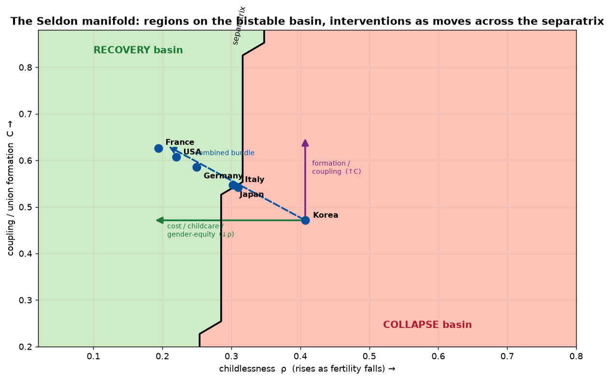
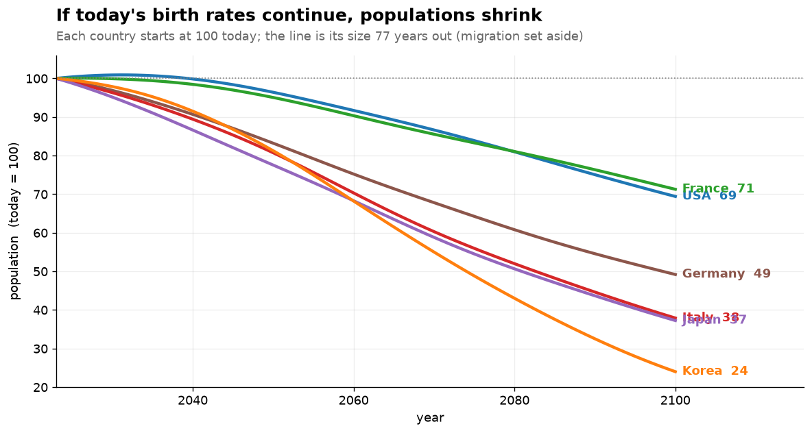

# sci-demographic-collapse

*Why the modern world is quietly running out of children - and what, if anything, can be done about it. A computer model, and the story it tells.*

[](https://www.python.org/)
[](https://pytorch.org/)
[](docs/experiments/demographic-collapse-experiments.md)
[](notebooks/)
[](docs/story.md)
[](docs/story.md)

In Isaac Asimov's *Foundation* novels, a scientist named Hari Seldon invents a way to forecast the future of an entire civilization. The trick is that he never tries to predict any single person - people are hopeless to predict - but reads the behaviour of billions at once, the way you cannot call a coin flip yet can call the average of a million with near-certainty. He calls it psychohistory, and with it he sees, centuries ahead, that his empire is already falling.

This project is a small, real, non-fictional version of that idea, aimed at one slow-motion crisis that nearly every rich country is now living through: the moment a society stops having enough children to replace itself. The model makes no attempt to tell any country its fortune. What it does - and what the rest of this page is about - is map the invisible forces underneath the headlines, and show where each country happens to be standing when the music stops.

## Two futures, and a very narrow ridge

Start with a picture. Imagine every country as a ball resting on a hilly landscape with two valleys. One valley is recovery: births bruised but bouncing, the population settling onto a stable, if smaller, footing. The other is decline - and it is not a gentle slope but a pit, where rolling deep enough in means every direction leads further down. Between the two runs a single narrow ridge.



The first uncomfortable thing the model has to say is about the shape of that landscape: most of it tilts toward the pit. Sweep through the possibilities and roughly two out of every three lead down into decline. A civilization does not have to be unlucky to fall. Falling is the default, and staying up is the thing that has to be earned, continuously.

The ridge itself sits at a startlingly precise place: about 1.5 children per woman. To merely hold its numbers level, a country needs around 2.1 - two children to replace two parents, plus a fraction for those who never reach adulthood. So the entire distance between "shrinking slowly, manageably" and "past the point of self-rescue" is about half a child per woman. That is the whole margin. (Tellingly, demographers who study low fertility (Lutz et al.) had already pinpointed this same 1.5 danger line from real-world data years before the model, built from scratch, independently placed its ridge in the very same spot. When an invented landscape drops its watershed onto someone else's measured cliff, it stops feeling like a toy.)

Where the great powers are standing today:

- **United States, 1.66** - just on the safe side, and held there by one thing alone
- **Europe, about 1.5** - balanced on the ridge itself
- **China, 1.2** - already over the edge
- **South Korea, 0.7** - not near the ridge and not merely over it, but far down the collapse slope, lower than any large society in recorded history

## What "collapse" actually looks like

Forget the word's Hollywood connotations. There is no plague here, no war, no single catastrophic year - and the model is oddly insistent on the point. What it shows instead is a long, quiet subtraction. A village loses its school, then its clinic, then its last shop. The country's median age climbs, decade by decade, until it is spending more on its endings than on its beginnings. Each generation arrives a little smaller than the one that raised it.

To make it concrete: if today's birth rates simply continued unchanged - and if we set immigration aside for a moment, to isolate the pure effect of births - here is where the model puts the major economies eighty years from now.



Korea ends the century at roughly a quarter of its present size. Italy and Japan land near a third. Even the fortunate ones, the United States and France, shed close to a third of themselves. Nobody in the picture holds level.

## Why it happens

Pull the crisis apart and three causes fall out - and they are not the ones the tabloids usually blame.

The largest, by a wide margin, is simply that fewer people are pairing up. Children, overwhelmingly, come from stable couples, so a society where lasting partnerships are growing rarer is a society quietly emptying its nurseries from the top down - not because parents are choosing smaller families, but because a rising share of people never become parents at all (Sobotka, 2017). This is the load-bearing wall of the whole structure. Everything else is trim.

The second is that people start later. The average age at a first child has drifted out of the low twenties and into the thirties, and while a delay is not a refusal, biology keeps its own schedule: postpone long enough and some children who were fully intended are simply never born. The third, and smallest, is a genuine change of heart - a real drop in how many children people want, not merely in when they want them.

## The clock you cannot see

Now for the least intuitive fact in the whole subject, and the one that keeps demographers awake at night. A population is not really a number; it is a shape - a stack of age-groups - and that shape carries momentum. A country full of young people will keep growing for decades even after its birth rate falls below replacement, simply because so many of them are only now reaching the age to have children. It is coasting, engine off, on the speed it already had. A country that has grown old, by contrast, begins shrinking the instant the rate drops, and would keep shrinking for a generation even if every couple returned to replacement tomorrow, because there are no longer enough young people to do the having.

The unsettling consequence is that the near future is, in large part, already written. Korea's population in 2050 was effectively decided in the 1990s, and no policy on earth can revisit that vote. And the model catches the United States mid-crossing: sometime in the last few decades it quietly slipped from the coasting kind of country to the shrinking kind. What holds its numbers level today is no longer a young population. It is immigration, and immigration alone.

## The one fast lever, and the slow ones that actually work

Which brings us to the only remedy that pays off inside a single lifetime. A newcomer arrives already grown, already of working and child-bearing age, and steps straight into the hollow middle of a population's shape; it does not take twenty years to matter. This is the entire secret of the American exception - remove immigration from the arithmetic and the United States begins to look a great deal like Europe. But it is worth being clear-eyed: migration reshuffles the world's young, and does nothing to explain or repair why a country stopped producing its own.

For that deeper repair, the model did something a pundit cannot. It weighed every proposed fix not by how good it sounds, but against the actual record of the places that have tried it - and the verdict is bracingly unsentimental. The things that work are the unglamorous ones that lower the true, lifelong cost of raising a child and let people pair off and parent without torching a career: real childcare, an honest split of the housework between men and women, family housing people can afford, security for the young, teaching couples the ordinary skills of a lasting relationship - communication, handling conflict, managing money together - as a school subject, and, more surprising, simply cutting the punishing work hours of places like Korea and Japan. What unites them is not their size but their staying power. They change the standing conditions of a life, and their effect lasts.

The thing that fails is the thing politicians reach for first: cash. A baby bonus buys a brief flurry of births, mostly from couples who were going to have the child anyway and merely shift its timing, and then the effect quietly evaporates. The proof is written in Korea, which spent some 270 billion dollars over twenty years and watched its birth rate fall in every one of them.

And two popular "cures" actively backfire. Pro-natal poster campaigns tend to wash straight over people. The perennial call to send women back to "traditional roles" is worse than useless - not neutral but negative, since the societies with the most old-fashioned division of domestic labour, Korea and Japan foremost, are precisely the ones with the lowest fertility on the planet. Ask a woman to shoulder both a full job and the entire household, and a great many will decline the second shift by declining the child.

## The cheapest fixes turn out to be the best

There is one last, faintly hopeful twist. When the model is asked not "what is most powerful" but "what buys the most improvement for the least money and effort", the winners are almost free - and they are the same short list for every country in the study:

- **Recognise unmarried couples in law**, the same as married ones - almost costless, and the single best value of anything tested
- **Teach relationships in school** - conflict resolution, communication, and managing family money. It is cheap to run and unusually well evidenced: a randomised trial of one such program cut couples' divorce rate to about a third (Stanley et al., 2010), and financial disagreement predicts divorce more powerfully than any other kind of argument (Dew et al., 2012). The mechanism is simple - a couple that stays together keeps more of its fertile years, and so has more time to have the children it wants
- **Nudge the culture toward fairness at home**, so that raising children is not a burden falling on women alone
- **Take the sharp edges off inequality**, so that having a child is less of a financial cliff

These help most when a country starts early, while it still has room to move. Cash handed out as baby bonuses, meanwhile, ranks dead last for value. The heralds of a recovery, it turns out, are cheap.

## The honest ending

The lesson underneath all of it is the one Asimov's fiction turned on: fate here is a matter of position and timing, not of effort or will. A country still near the ridge - the United States, France, even Italy - can genuinely turn itself around, provided the effort is early, broad, and built to last. A country already far down the slope - Korea, Japan - can, with the very same maximal effort, only soften its fall from a collapse into a decline; its base of young people is simply too thin for a single century to refill. The window does not slam shut. It closes the way everything in this story moves - slowly, quietly, one generation at a time - which is exactly why the decisions that matter most are the ones being taken right now.

> [!NOTE]
> This is a learning project, and the model is a deliberately simplified picture, tuned to reproduce how real populations have actually behaved. It ranks forces and places countries on a map. It is not a crystal ball, and it predicts no nation's future.

## How we got here (and why it's worth trusting)

The short version of a long road, in plain steps:

1. **Started with a hypothesis** - a claim about why populations collapse, and what governs the timing and the depth
2. **Wrote it down as equations** - a working model of births, pairing, ageing and the economy
3. **Turned the equations into a simulation** you can run forward in time
4. **Grounded every assumption in published research**, not guesswork
5. **Calibrated the model to real data**
6. **Made predictions with it** - and, crucially, ones we could check
7. **Then tested it hard** - out-of-sample, on data it had never seen, and against real historical shocks: the 2008 recession, the COVID dip, Korea's 1997 crisis, German reunification
8. **Kept what worked and stayed honest about what didn't** - the demographic backbone reproduces history and places every country correctly; the behavioural layer is a deliberately simplified, roughly-tuned picture, not a precision instrument
9. **Mapped the dividing line** between recovery and decline - the ridge in the first picture above
10. **Hypothesised interventions** - a great many, across the board, fanning out and checking how they interact with each other
11. **Scored each one analytically**, side effects and interactions included
12. **Ran each through the simulation** for several generations, to see what actually bends the curve over time, not just on paper
13. **Rated them by their cost to society** - money, coercion and side effects together
14. **Stripped the bundles down** to find the cheapest thing that still helps

And the technical guts, for anyone who wants them: at its heart is a small system of **nine coupled first-order differential equations** - formulas that track how pairing, childbearing, ageing, the timing of births and the local economy push on one another - rolled forward a year at a time, alongside a standard age-by-age population projection (a Leslie model). The calibration is **Bayesian**: it fits whole probability distributions rather than single best-guess numbers, using the well-known **reparameterisation trick** (Kingma & Welling, 2014) so the fitting can be done by ordinary gradient descent. It all runs on a graphics card, so thousands of scenarios finish in seconds.

## The full trail

- **15 notebooks** (`notebooks/01…15`) - the whole investigation, step by step
- **The evidence log** - all 194 questions put to the model and how each turned out: [`docs/experiments/demographic-collapse-experiments.md`](docs/experiments/demographic-collapse-experiments.md)
- **The plain-language story** - [`docs/story.md`](docs/story.md)
- **The intervention guide** - [`docs/interventions.md`](docs/interventions.md)

## Run it

```bash
make install     # set up the environment and install the package
make test        # run the tests
```

## Makefile and project map

- `make install` / `make test` / `make lint` / `make format` / `make build` / `make clean` - the usual developer commands (`make help` lists them all)

```
├── data/raw            <- the source population data (United Nations, World Bank, and others)
├── notebooks           <- 01…15, the investigation end to end
├── src                 <- the reusable model code
├── docs                <- the story, the design, the intervention guide, the evidence log
├── reports/figures     <- every chart the notebooks produced
└── references/papers   <- the research papers behind the findings, with plain-language summaries
```
